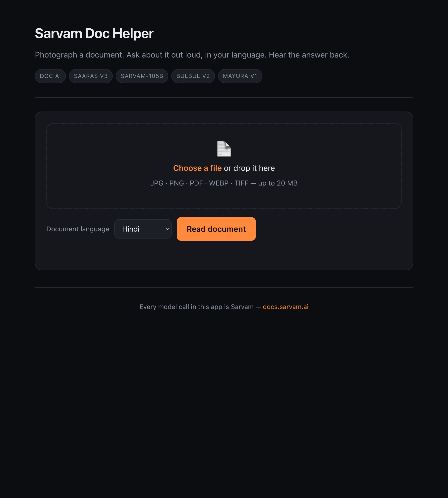

# Sarvam Doc Helper

**Photograph a document. Ask about it out loud, in your language. Hear the answer back.**

A rental agreement, an electricity bill, a hospital discharge summary, a land record — for
a lot of people in India the hard part isn't getting the document, it's reading it. This is a
voice interface for exactly that: point a camera at a page, then ask it questions the way
you'd ask a person who could read it for you.

Every model call in this app is Sarvam.



---

## The pipeline

```
  photo / PDF
      │
      ▼
  Sarvam Doc AI ──────────► markdown + tables, cached per session
      │
  ┌───┴───────────────────────────────┐
  │                                   │
  ▼                                   ▼
 ASK BY VOICE                    EXTRACT FIELDS
  │                                   │
  │ 🎙 Saaras v3   speech → text       │ plain-English field list
  │   (auto-detects the language)      │        │
  │        │                           │        ▼
  │        ▼                           │   sarvam-105b → JSON
  │   sarvam-105b  grounded answer     │   (null when absent —
  │        │        (streamed)         │    never invented)
  │        ▼                           │
  │   Bulbul v2    text → speech       │
  ▼                                    ▼
 spoken reply                     structured table
```

`Mayura v1` is wired up at `/translate` for turning an answer into a second language.

---

## Two things I had to actually solve

Most of the build was plumbing. Two problems were not, and both are visible in the code.

### 1. Multi-turn conversation silently locks to one language

This is the bug I'd want to talk about. Ask a question in Hindi, then follow up in English,
and the English question still gets answered in Hindi. Once one Hindi assistant turn is in
the message list, it anchors every later reply.

I tried to instruct my way out of it. All of these still returned Hindi:

| Attempt | Result |
|---|---|
| `[Answer in English.]` appended to the user turn | Hindi |
| `[Reply ONLY in English. Do not reply in Hindi.]` | Hindi |
| A system message after the history: *"You MUST write your entire reply in English…"* | Hindi |
| Both of the above together | Hindi |
| **Dropping the history entirely** | **English** |

So it wasn't a prompt-strength problem — the history itself was the cause, and no
instruction outranked it.

The fix keeps the history but changes *where* it lives. Prior turns move out of the message
list and into the system prompt as plain recap text, leaving the current question as the
only `user` message. The model still resolves *"and what about the notice period?"* and
*"is it refundable?"* against earlier turns, but takes its reply language from the live
question. Verified in both directions — Hindi → English and English → Hindi, plus Kannada.

See `build_recap()` in [`app.py`](app.py); the reasoning is written down there so it doesn't
get "simplified" back into a bug. Regression tests in [`tests/test_app.py`](tests/test_app.py).

### 2. The model thinks for 7–10 seconds before it says anything

`sarvam-105b` is a reasoning model. It spends most of its wall clock emitting
`reasoning_content` before the first token of the actual answer:

- Answering *"reply with exactly: OK"* costs **565 completion tokens**
- On a real document question, **913–1373 reasoning chunks** arrive before the answer starts
- `reasoning_effort: "low"` does **not** meaningfully help — measured 12.1s vs 10.1s for
  `"high"` on the same question, i.e. within noise and occasionally slower

You can't remove the wait (`reasoning_effort` only accepts `low`/`medium`/`high` — there's no
"off"), so the app is built around it instead. `/respond` streams Server-Sent Events and
separates the two channels: reasoning deltas become a live *"Reading the document — 7.4s"*
counter, and answer deltas render token by token. A ten-second wait with visible progress
reads very differently from a ten-second frozen spinner.

---

## Measured latency

One-page PDF, single machine, ordinary broadband. Real observed numbers — reproduce with
`python tests/e2e.py` (needs a key).

| Step | Model | Observed |
|---|---|---|
| Speech → text | Saaras v3 | **1.6s** |
| Document digitization | Doc AI | **7.2–7.6s** (once per document) |
| Field extraction, 5–7 fields | sarvam-105b | **2.1–15.2s** |
| Grounded answer, end to end | sarvam-105b + Bulbul v2 | **8.1–16.3s** |
| └ first answer token | | 7.0–9.9s |

Two honest caveats on these. **Anything that routes through `sarvam-105b` varies a lot
run to run** — the same 5-field extraction measured 2.1s once and 15.2s another time, on
an unchanged document and prompt. Reasoning length is the variable, and it isn't stable, so
treat the ranges as ranges rather than picking the flattering end. Digitization and speech
recognition were consistent across every run.

Digitization happens once; every later question only pays the answer cost.

---

## Grounding

The system prompt restricts answers to the extracted text, and it holds up:

- *"What is the landlord's blood group?"* → **"दस्तावेज़ में लैंडलॉर्ड के ब्लड ग्रुप का उल्लेख नहीं है।"**
  (not mentioned in the document)
- Extracting a `pet policy` field from an agreement that has no pet clause returns
  `"pet policy": null` rather than a plausible invention

There's also a **View extracted text** button in the UI showing exactly what the model can
see. If an answer looks wrong, you can check whether the OCR or the model was at fault.

---

## Running it

```bash
git clone https://github.com/Hritikd/sarvam-doc-helper.git
cd sarvam-doc-helper

python -m venv .venv && source .venv/bin/activate
pip install -r requirements.txt

cp .env.example .env      # then paste your key from dashboard.sarvam.ai
python app.py             # → http://localhost:8000
```

A sample document is included at `samples/rental-agreement.pdf` if you want something to
try immediately.

```bash
python tests/test_app.py  # offline tests, no key needed
```

Deploying: `Procfile` runs gunicorn with threads, which the SSE endpoint needs.

---

## API

| Endpoint | Purpose |
|---|---|
| `POST /document` | Upload a page; digitization starts in the background |
| `GET /document/status` | Poll for `processing` / `ready` / `failed` |
| `GET /document/text` | The extracted text the model is working from |
| `POST /transcribe` | Audio → text, and remembers the detected language |
| `POST /respond` | **SSE stream**: `thinking` → `answer` → `audio` → `done` |
| `POST /extract` | Plain-English field list → JSON |
| `POST /speak` | Text → speech |
| `POST /translate` | Text → another Indian language |
| `GET /health` | Liveness + active session count |

---

## Known limits

Worth being straight about what this is and isn't:

- **Sessions are in-memory.** Fine for one process; a restart drops documents, and running
  multiple gunicorn *workers* would split state. Redis is the fix, and threads (not workers)
  are what the Procfile uses for now.
- **No auth or rate limiting.** Anyone who can reach the instance can spend your credits.
- **Tested on single-page documents.** Doc AI handles multi-page and the code joins pages in
  order, but I haven't measured long documents; text is truncated at 24k characters.
- **8–16s per answer**, for the reasons above, and not consistently at the fast end.
  Acceptable for a document you're puzzling over, too slow for a real-time conversation.
- **Handwriting is untested.** Printed text is what I verified.

---

Built on [Sarvam](https://docs.sarvam.ai) — Doc AI, Saaras v3, sarvam-105b, Bulbul v2, Mayura v1.
