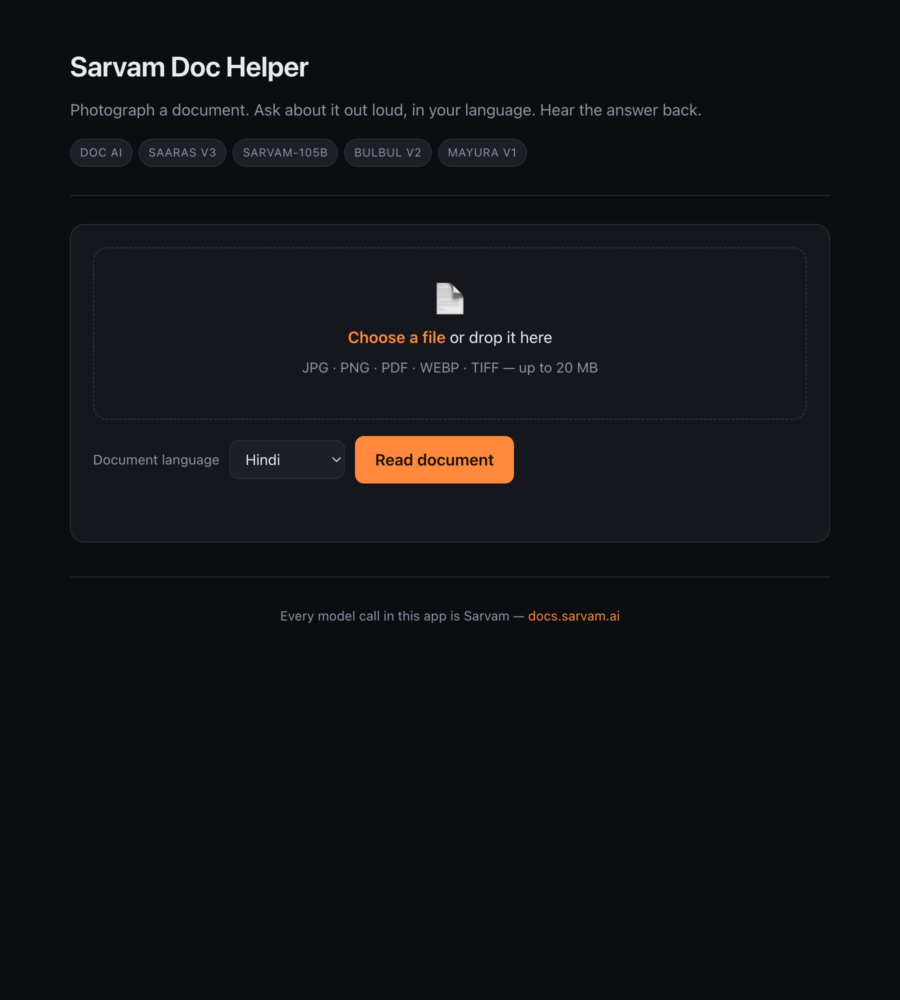

# Sarvam Doc Helper

**Photograph a document. Ask about it out loud, in your language. Hear the answer back.**

A rental agreement, an electricity bill, a hospital discharge summary, a land record — for
a lot of people in India the hard part isn't getting the document, it's reading it. This is a
voice interface for exactly that: point a camera at a page, then ask it questions the way
you'd ask a person who could read it for you.

Every model call in this app is Sarvam.



---

## The pipeline

```
  photo / PDF
      │
      ▼
  Sarvam Doc AI ──────────► markdown + tables, cached per session
      │
  ┌───┴───────────────────────────────┐
  │                                   │
  ▼                                   ▼
 ASK BY VOICE                    EXTRACT FIELDS
  │                                   │
  │ 🎙 Saaras v3   speech → text       │ plain-English field list
  │   (auto-detects the language)      │        │
  │        │                           │        ▼
  │        ▼                           │   sarvam-105b → JSON
  │   sarvam-105b  grounded answer     │   (prompted to use null
  │        │        (streamed)         │    when absent)
  │        ▼                           │
  │   Bulbul v2    text → speech       │
  ▼                                    ▼
 spoken reply                     structured table
```

`Mayura v1` is wired up at `/translate` for turning an answer into a second language.

---

## Two implementation decisions

Most of the build was plumbing. Two problems were not, and both are visible in the code.

### 1. Multi-turn conversation silently locks to one language

In the recorded development checks, a question in Hindi followed by one in English showed a language-anchoring problem:
and the English question still gets answered in Hindi. Once one Hindi assistant turn is in
the message list, it anchors every later reply.

I tried to instruct my way out of it. All of these still returned Hindi:

| Attempt | Result |
|---|---|
| `[Answer in English.]` appended to the user turn | Hindi |
| `[Reply ONLY in English. Do not reply in Hindi.]` | Hindi |
| A system message after the history: *"You MUST write your entire reply in English…"* | Hindi |
| Both of the above together | Hindi |
| **Dropping the history entirely** | **English** |

Those checks suggested that prior assistant turns were anchoring the response language. They do not establish that stronger instructions can never work.

The fix keeps the history but changes *where* it lives. Prior turns move out of the message
list and into the system prompt as plain recap text, leaving the current question as the
only `user` message. The model still resolves *"and what about the notice period?"* and
*"is it refundable?"* against earlier turns, but takes its reply language from the live
question. The development notes record checks in both directions, Hindi → English and English → Hindi, plus Kannada. The offline suite checks recap construction; it does not verify a live model’s language behavior.

See `build_recap()` in [`app.py`](app.py); the reasoning is written down there so it doesn't
get "simplified" back into a bug. Regression tests in [`tests/test_app.py`](tests/test_app.py).

### 2. Show progress while waiting for an answer

In the recorded development configuration, `sarvam-105b` emitted `reasoning_content` before the first answer token. The notes record:

- One *"reply with exactly: OK"* request used **565 completion tokens**
- Document-question checks produced **913–1373 reasoning chunks** before the answer started
- One `reasoning_effort: "low"` check took 12.1s versus 10.1s for `"high"` on the same question; that pair alone cannot establish which setting is faster

This implementation uses `reasoning_effort="high"`. The observations below describe that development configuration; they are not a claim about every current model or API option. The app handles the wait explicitly. `/respond` streams Server-Sent Events and
separates the two channels: reasoning deltas become a live *"Reading the document — 7.4s"*
counter, and answer deltas render token by token. A ten-second wait with visible progress
reads very differently from a ten-second frozen spinner.

---

## Recorded development timings

One-page PDF, single machine, ordinary broadband. Historical development observations; raw timing logs are not included. Recheck with
`python tests/e2e.py` (needs a key).

| Step | Model | Observed |
|---|---|---|
| Speech → text | Saaras v3 | **1.6s** |
| Document digitization | Doc AI | **7.2–7.6s** (once per document) |
| Field extraction, 5–7 fields | sarvam-105b | **2.1–15.2s** |
| Grounded answer, end to end | sarvam-105b + Bulbul v2 | **8.1–16.3s** |
| └ first answer token | | 7.0–9.9s |

Two honest caveats on these. **Anything that routes through `sarvam-105b` varies a lot
run to run** — the same 5-field extraction measured 2.1s once and 15.2s another time, on
an unchanged document and prompt. Reasoning length is the variable, and it isn't stable, so
treat the ranges as ranges rather than picking the flattering end. No repeated-run distribution or service-level guarantee is established here.

Digitization happens once; every later question only pays the answer cost.

---

## Grounding

The system prompt asks for answers grounded in the extracted text. Recorded examples include:

- *"What is the landlord's blood group?"* → **"दस्तावेज़ में लैंडलॉर्ड के ब्लड ग्रुप का उल्लेख नहीं है।"**
  (not mentioned in the document)
- Extracting a `pet policy` field from an agreement that has no pet clause returns
  `"pet policy": null` rather than a plausible invention

There's also a **View extracted text** button in the UI showing exactly what the model can
see. If an answer looks wrong, you can check whether the OCR or the model was at fault.

---

## Running it

```bash
git clone https://github.com/Hritikd/sarvam-doc-helper.git
cd sarvam-doc-helper

python -m venv .venv && source .venv/bin/activate
pip install -r requirements.txt

cp .env.example .env      # then paste your key from dashboard.sarvam.ai
python app.py             # → http://localhost:8000
```

A sample document is included at `samples/rental-agreement.pdf` if you want something to
try immediately.

```bash
python tests/test_app.py  # offline tests, no key needed
```

Deploying: `Procfile` runs gunicorn with threads, which the SSE endpoint needs.

---

## API

| Endpoint | Purpose |
|---|---|
| `POST /document` | Upload a page; digitization starts in the background |
| `GET /document/status` | Poll for `processing` / `ready` / `failed` |
| `GET /document/text` | The extracted text the model is working from |
| `POST /transcribe` | Audio → text, and remembers the detected language |
| `POST /respond` | **SSE stream**: `thinking` → `answer` → `audio` → `done` |
| `POST /extract` | Plain-English field list → JSON |
| `POST /speak` | Text → speech |
| `POST /translate` | Text → another Indian language |
| `GET /health` | Liveness + active session count |

---

## Known limits

- **Sessions are in-memory.** Fine for one process; a restart drops documents, and running
  multiple gunicorn *workers* would split state. Redis is the fix, and threads (not workers)
  are what the Procfile uses for now.
- **No auth or rate limiting.** Anyone who can reach the instance can spend your credits.
- **Tested on single-page documents.** Doc AI handles multi-page and the code joins pages in
  order, but I haven't measured long documents; text is truncated at 24k characters.
- **8–16s per answer**, for the reasons above, and not consistently at the fast end.
  Acceptable for a document you're puzzling over, too slow for a real-time conversation.
- **Handwriting is untested.** The documented checks use printed text.
- **Prompt-based grounding is not a guarantee.** Document text and conversation history are untrusted inputs, including when placed in the system prompt. Prompt injection and incorrect answers remain possible.
- **Use fictional documents.** Uploaded content is processed by external APIs; there is no production access-control or privacy review for this prototype.

---

Built on [Sarvam](https://docs.sarvam.ai) — Doc AI, Saaras v3, sarvam-105b, Bulbul v2, Mayura v1.
